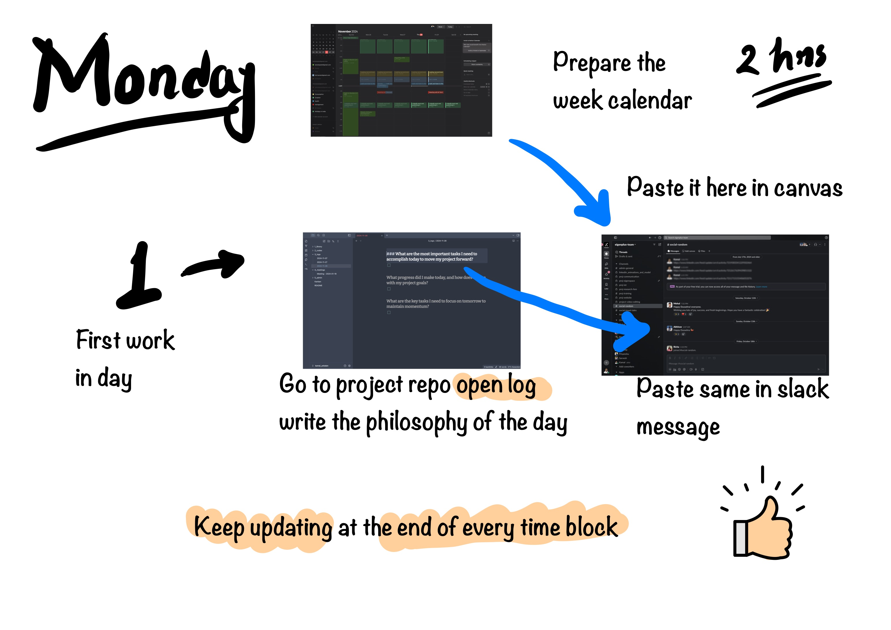
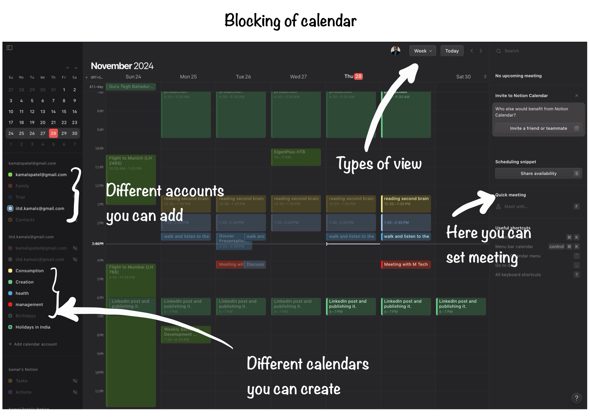
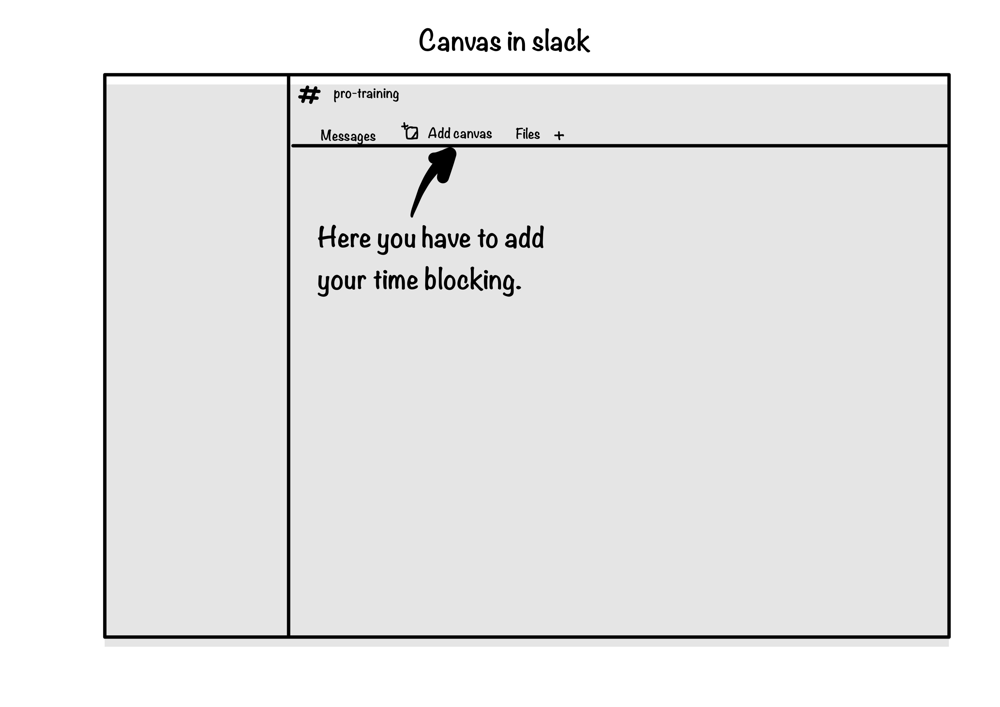

**1.1 Weekly Time Allocation and Planning:**

- Employees are required to dedicate up to **2 hours every Monday** to plan their 40-hour workweek. This planning process must follow a **95:5 ratio** (95% time on auto pilot, 5% on conscious decision).
- A **one-pager weekly report** must be prepared after discussions with the team leader or senior. This report serves as the blueprint for the week's tasks.

**1.2. Time Blocking and Segmentation:**

- Work must be time-blocked into **specific categories**:
    - **Creation**
    - **Consumption**
    - **Management**
    - **Health**
- Time blocks must be clearly defined, color-coded, and aligned with the employee’s weekly objectives. For example, a health block may include activities such as walking, yoga, or meditation.
- The time-blocked schedule must be shared on the **project canvas** by Monday for leader review and approval.

**1.3. Repository and Communication Tools:**

- Each project will have:
    - **A dedicated repository** containing log folders.
    - **A Slack channel** for real-time updates.
    - **An Overleaf document** (if applicable) for documentation.

**1.4. Daily Logs:**

- At the start of each workday, employees must log **planned actions** in the project repository and Slack channel.
- Tasks must be broken into **action items** that are achievable within a 2-hour time frame.
- Time estimates for each action item must be included.

**1.5. SMART Goals:**

- Action items must adhere to the **SMART philosophy** (Specific, Measurable, Achievable, Relevant, Time-bound).

**1.6. Concluding Work:**

- At the end of each time block, employees must allocate **5 minutes** to document the following:
    - **Context** (why the work was undertaken).
    - **Status** (progress or completion).
    - **Location and position** of files or folders related to the task.